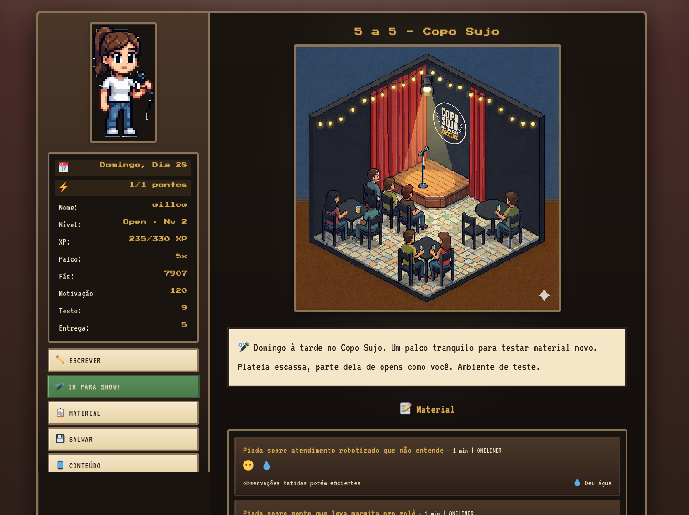
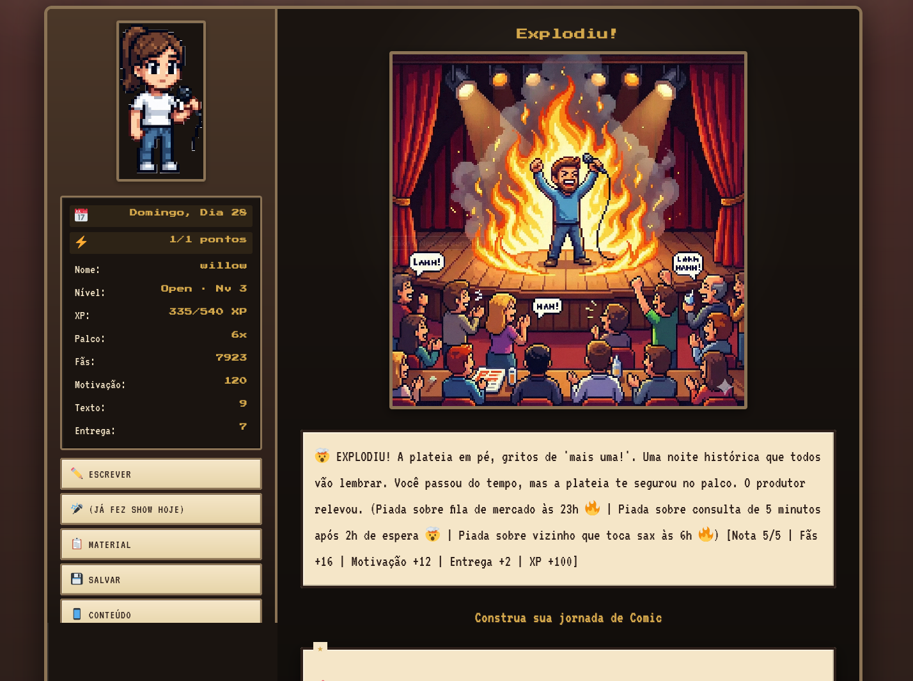

# Open Mic RPG 🎤


## Visão Geral / Overview

Open Mic RPG é um jogo de RPG no navegador onde você vive a jornada de um comediante stand-up, desde os primeiros passos no open mic até se tornar um profissional estabelecido. O jogo combina mecânicas de escrita de piadas, apresentações em shows, progressão de personagem e um sistema de dia/semana para criar uma experiência imersiva e estratégica.

**Open Mic RPG is a browser-based RPG game where you live the journey of a stand-up comedian, from your first steps at open mic nights to becoming an established professional. The game combines joke writing mechanics, show performances, character progression, and a day/week system to create an immersive and strategic experience.**

Desenvolvido com JavaScript vanilla, HTML5 e CSS3, o jogo oferece uma experiência retro inspirada em RPGs clássicos de SNES, com uma interface pixelada e animações suaves que capturam a essência dos jogos de comédia stand-up.

**Built with vanilla JavaScript, HTML5, and CSS3, the game offers a retro experience inspired by classic SNES RPGs, with a pixelated interface and smooth animations that capture the essence of stand-up comedy games.**

## Screenshots / Capturas de Tela

<div align="center">
  
  <p><em>Interface principal do jogo / Main game interface</em></p>
</div>

<div align="center">
  
  <p><em>Sistema de escrita de piadas e gerenciamento de material / Joke writing system and material management</em></p>
</div>

## Funcionalidades Principais / Main Features 🚀

### ✏️ Sistema de Escrita de Piadas
- **Dois modos de escrita**: "Sentar e escrever" (mais eficiente, gasta motivação) ou "Anotar durante o dia" (gratuito, menos eficiente)
- **Sistema de potencial**: Cada piada tem um potencial baseado em suas estatísticas (texto, motivação) e modo de escrita
- **Customização**: Escolha o tom (besteirol, vulgar, limpo, humor negro, hack) e estrutura (oneliner, bit, storytelling, prop)
- **Reescrita**: Melhore piadas existentes usando experiência e recursos
- **Pool de ideias**: Mais de 50 ideias pré-definidas para inspirar sua escrita

**Two writing modes**: "Sit and write" (more efficient, costs motivation) or "Note during the day" (free, less efficient) | **Potential system**: Each joke has potential based on your stats (texto, motivation) and writing mode | **Customization**: Choose tone (besteirol, vulgar, limpo, humor negro, hack) and structure (oneliner, bit, storytelling, prop) | **Rewriting**: Improve existing jokes using experience and resources | **Idea pool**: Over 50 predefined ideas to inspire your writing**

### 🎭 Sistema de Shows
- **Diversos tipos de shows**: Open mics, shows pagos, corporativos, especiais
- **Pacote Open expandido**: Novas casas iniciantes com foco em aprendizado de set curto
- **Headliner por textos**: No headliner, você organiza sets completos (`textos`) para solos
- **Sistema de dificuldade**: Cada show tem uma dificuldade que afeta seu desempenho
- **Afinidade de tipo**: Diferentes shows favorecem diferentes tons e estruturas
- **Sistema de notas**: De 1 (deu água) a 5 (explodiu), com feedback visual e narrativo
- **Agendamento**: Agende até 3 shows por vez e gerencie sua agenda
- **Histórico**: Acompanhe seu desempenho ao longo do tempo

**Various show types**: Open mics, paid shows, corporate events, specials | **Difficulty system**: Each show has difficulty that affects your performance | **Type affinity**: Different shows favor different tones and structures | **Rating system**: From 1 (bombed) to 5 (exploded), with visual and narrative feedback | **Scheduling**: Schedule up to 3 shows at once and manage your calendar | **History**: Track your performance over time**

### 📊 Sistema de Progressão
- **Estatísticas principais**:
  - **Texto**: Afeta a qualidade das piadas que você escreve (máx. 200)
  - **Entrega**: Afeta seu desempenho nos shows e reduz dificuldade (máx. 200)
  - **Motivação**: Recursos necessários para escrever piadas melhores
  - **Fãs**: Popularidade que desbloqueia oportunidades
- **Arco de carreira**: Progressão de `Open` para `Elenco` e depois `Headliner`
- **Sistema de XP**: Ganhe experiência através de shows e atividades
- **Perks/Talents**: Duas árvores de habilidades (Texto e Entrega) com mais de 10 perks únicos
- **Flow State**: Estado especial que aumenta sua eficiência temporariamente

**Main stats**: Texto (affects joke quality, max 200), Entrega (affects show performance, max 200), Motivation (resource for writing better jokes), Fans (popularity that unlocks opportunities) | **Career arc**: Progression from `Open` to `Elenco` to `Headliner` | **XP system**: Gain experience through shows and activities | **Perks/Talents**: Two skill trees (Texto and Entrega) with over 10 unique perks | **Flow State**: Special state that temporarily increases efficiency**

### ⏰ Sistema de Tempo
- **Dias e semanas**: Gerencie seu tempo dia a dia
- **Pontos de atividade**: Limite de ações por dia (1-3 dependendo do emprego)
- **Sistema de emprego**: Trabalhos que afetam seus pontos de atividade e progressão
- **Eventos semanais**: Eventos especiais que aparecem durante a semana
- **Histórico de shows**: Acompanhe seus shows passados com métricas detalhadas

**Days and weeks**: Manage your time day by day | **Activity points**: Limit of actions per day (1-3 depending on employment) | **Employment system**: Jobs that affect your activity points and progression | **Weekly events**: Special events that appear during the week | **Show history**: Track your past shows with detailed metrics**

### 🎨 Sistema de Conteúdo e Estudo
- **Criar conteúdo**: Gere conteúdo digital para ganhar fãs e recursos
- **Estudar**: Melhore suas habilidades através de estudo e referências
- **Material**: Gerencie seu repertório de piadas, reescreva e organize
- **Histórico completo**: Visualize todas as suas apresentações e estatísticas

**Create content**: Generate digital content to gain fans and resources | **Study**: Improve your skills through study and references | **Material**: Manage your joke repertoire, rewrite and organize | **Complete history**: View all your performances and statistics**

### 💾 Sistema de Persistência
- **Salvamento automático**: Seu progresso é salvo automaticamente no navegador
- **Carregamento**: Retome de onde parou a qualquer momento
- **Múltiplos saves**: Suporte para diferentes partidas

**Auto-save**: Your progress is automatically saved in the browser | **Loading**: Resume from where you left off at any time | **Multiple saves**: Support for different playthroughs**

## Tecnologias Utilizadas / Technology Stack 💻

### Frontend
- **JavaScript (ES6+)**: Lógica do jogo, mecânicas e sistemas
- **HTML5**: Estrutura e semântica
- **CSS3**: Estilização retro inspirada em SNES, animações e responsividade
- **LocalStorage API**: Sistema de salvamento persistente
- **Canvas/Web APIs**: Efeitos visuais e animações

**JavaScript (ES6+)**: Game logic, mechanics and systems | **HTML5**: Structure and semantics | **CSS3**: Retro styling inspired by SNES, animations and responsiveness | **LocalStorage API**: Persistent save system | **Canvas/Web APIs**: Visual effects and animations**

### Design & UX
- **Retro RPG Style**: Interface inspirada em RPGs clássicos de SNES
- **Pixel Art Aesthetic**: Visualização pixelada e estética retrô
- **Responsive Design**: Funciona em desktop e mobile
- **Smooth Animations**: Animações suaves e feedback visual imediato
- **Acessibilidade**: Interface clara e intuitiva

**Retro RPG Style**: Interface inspired by classic SNES RPGs | **Pixel Art Aesthetic**: Pixelated visualization and retro aesthetic | **Responsive Design**: Works on desktop and mobile | **Smooth Animations**: Smooth animations and immediate visual feedback | **Accessibility**: Clear and intuitive interface**

## Como Jogar / How to Play 🎮

### Início / Getting Started
1. **Crie seu personagem**: Escolha seu nome artístico e avatar
2. **Tutorial**: Siga as instruções do Professor Carvalho
3. **Primeiras ações**: Escreva piadas e busque shows para começar

**Create your character**: Choose your stage name and avatar | **Tutorial**: Follow Professor Carvalho's instructions | **First actions**: Write jokes and search for shows to get started**

### Estratégia Básica / Basic Strategy
- **Balance texto e entrega**: Ambas as estatísticas são importantes
- **Gerencie motivação**: Use "Sentar e escrever" quando tiver motivação suficiente
- **Escolha shows adequados**: Diferentes shows favorecem diferentes tipos de piadas
- **Invista em perks**: Escolha perks que complementem seu estilo de jogo
- **Mantenha um repertório**: Tenha piadas variadas para diferentes situações

**Balance texto and entrega**: Both stats are important | **Manage motivation**: Use "Sit and write" when you have enough motivation | **Choose appropriate shows**: Different shows favor different joke types | **Invest in perks**: Choose perks that complement your playstyle | **Maintain a repertoire**: Have varied jokes for different situations**

### Dicas Avançadas / Advanced Tips
- **Flow State**: Aproveite períodos de flow para escrever mais piadas
- **Reescreva piadas**: Melhore piadas antigas em vez de sempre criar novas
- **Agende shows**: Planeje com antecedência para maximizar oportunidades
- **Estude**: Use o sistema de estudo para melhorar suas habilidades
- **Crie conteúdo**: Gere conteúdo digital para ganhar fãs passivamente

**Flow State**: Take advantage of flow periods to write more jokes | **Rewrite jokes**: Improve old jokes instead of always creating new ones | **Schedule shows**: Plan ahead to maximize opportunities | **Study**: Use the study system to improve your skills | **Create content**: Generate digital content to gain fans passively**

## Estrutura do Projeto / Project Structure

```
openmicrpg1/
├── index.html          # Página principal / Main page
├── script.js           # Lógica principal do jogo / Main game logic
├── styles.css          # Estilos e animações / Styles and animations
├── BALANCE_ANALYSIS.md # Histórico de balanceamento / Balance history
├── BALANCE_CHANGES.md  # Histórico de mudanças / Change history
├── CAP_*.md           # Histórico de caps e simulações / Cap history
├── docs/
│   └── GAME_MECHANICS.md # Referência canônica / Canonical mechanics reference
└── assets/            # Imagens e recursos / Images and resources
    ├── avatar*.png    # Avatares do jogador / Player avatars
    ├── carvalho.png   # Professor Carvalho / Professor Carvalho
    └── *.png          # Imagens de cenas e shows / Scene and show images
```

**`index.html` - Main page | `script.js` - Main game logic | `styles.css` - Styles and animations | `docs/GAME_MECHANICS.md` - Canonical mechanics reference | `BALANCE_*.md`/`CAP_*.md` - Historical balance notes | `assets/` - Images and resources**

## Mecânicas do Jogo / Game Mechanics 🎲

> Referência canônica para agentes e mudanças de balanceamento: [`docs/GAME_MECHANICS.md`](docs/GAME_MECHANICS.md).
> Os arquivos `BALANCE_*.md` e `CAP_*.md` são histórico de decisões e podem estar parcialmente defasados.

### Sistema de Escrita / Writing System
- **Potencial base**: 0.35-0.85 (aleatório)
- **Modificadores**: texto/250, (motivação-60)/400, modo de escrita, flow, perks
- **Duração por estrutura**: oneliner/prop 1 min, bit 2-3 min, storytelling 3-5 min
- **Cap máximo**: 0.98
- **Falha**: Chance de não gerar piada (10% sentar e escrever, 20% anotar durante o dia)

**Base potential**: 0.35-0.85 (random) | **Modifiers**: texto/250, (motivation-60)/400, writing mode, flow, perks | **Structure duration**: oneliner/prop 1 min, bit 2-3 min, storytelling 3-5 min | **Max cap**: 0.98 | **Failure**: Chance of not generating joke (10% desk, 20% day)**

### Sistema de Performance / Performance System
- **Componentes de score**:
  - Potência da piada (60% do peso)
  - Afinidade de tipo (20% do peso)
  - Rolagem de caos/luck (±0.10 reduzido por entrega)
  - Penalidade de dificuldade (reduzida por entrega)
  - Bônus de entrega (+0.40 máximo)
  - Bônus de flow (+0.08)
  - Bônus de perks
- **Notas**: 5 (explodiu), 4 (matou), 3 (segurou), 2 (risinhos), 1 (deu água)

**Score components**: Joke potency (60% weight), Type affinity (20% weight), Chaos/luck roll (±0.10 reduced by entrega), Difficulty penalty (reduced by entrega), Delivery bonus (+0.40 max), Flow bonus (+0.08), Perk bonuses | **Ratings**: 5 (exploded), 4 (killed), 3 (held), 2 (giggles), 1 (bombed)**

### Sistema de Progressão / Progression System
- **Caps de estatísticas**: Texto e Entrega têm cap de 200
- **Níveis**: Progressão baseada em experiência de palco; sets com material novo rendem mais XP que sets já consolidados
- **Perks**: Desbloqueados em níveis específicos, requerem pré-requisitos
- **Flow State**: Ativado por shows consecutivos bons, aumenta eficiência

**Stat caps**: Texto and Entrega have cap of 200 | **Levels**: Progression is based on stage experience; sets with newer material grant more XP than consolidated sets | **Perks**: Unlocked at specific levels, require prerequisites | **Flow State**: Activated by consecutive good shows, increases efficiency**

## Funcionalidades em Destaque / Highlighted Features

### Sistema de Classes / Class System
O jogo já possui classes profissionais que modificam a experiência e desbloqueiam trajetórias de carreira:
- **Cômico Clássico**: Stand-up puro, turnês
- **Roteirista**: Escrita para outros, programas
- **Produtor**: Shows e gestão
- **Ator Cômico**: Performance, TV, cinema
- **Influencer**: Conteúdo digital, virais
- **Professor**: Ensino e teoria da comédia

**The game now includes professional classes that shape progression and career opportunities: Classic Comedian, Screenwriter, Producer, Comic Actor, Influencer, Professor**

### Professor Carvalho Guidance
Professor Carvalho atua como mentor ao longo do jogo, com diálogos de orientação em marcos importantes (primeiro bomb, primeiro kill, transições de carreira e momentos de baixa motivação).

### Legacy Choice Endgame
No arco final de `Headliner`, você escolhe qual legado quer construir (estrada, autoria ou híbrido palco+mídia) e recebe um epílogo com avaliação multidimensional.

### Taping Special (Finale Gate)
A gravação do especial (`Taping Special`) é um marco obrigatório do arco final. O legado só é liberado após concluir a gravação.

### Sistema de Eventos / Event System
Eventos especiais aparecem durante a semana, oferecendo oportunidades únicas, desafios e recompensas que podem mudar o curso da sua carreira.

**Special events appear during the week, offering unique opportunities, challenges, and rewards that can change the course of your career.**

### Sistema de Shows Especiais / Special Shows System
Shows especiais como "5a5" e "Pague 15" oferecem desafios únicos e recompensas maiores, desbloqueados através de eventos especiais.

**Special shows like "5a5" and "Pague 15" offer unique challenges and greater rewards, unlocked through special events.**

## Contribuindo / Contributing

Contribuições são bem-vindas! Sinta-se à vontade para abrir issues ou pull requests.

**Contributions are welcome! Feel free to open issues or pull requests.**

### Áreas para Contribuição / Areas for Contribution
- **Balanceamento**: Ajustes nas fórmulas e mecânicas
- **Conteúdo**: Novas ideias de piadas, shows e eventos
- **UI/UX**: Melhorias na interface e experiência do usuário
- **Tradução**: Traduções para outros idiomas
- **Bugs**: Correção de bugs e problemas

**Balancing**: Adjustments to formulas and mechanics | **Content**: New joke ideas, shows, and events | **UI/UX**: Interface and user experience improvements | **Translation**: Translations to other languages | **Bugs**: Bug fixes and issues**

## Licença / License

Este projeto está sob a licença MIT.

**This project is licensed under the MIT License.**

## Autor / Author

Desenvolvido por illan

**Developed by illan**

---

**Nota**: Este projeto é um jogo de simulação de carreira de comediante stand-up, oferecendo uma experiência única de gerenciamento de recursos, estratégia e progressão de personagem.

**Note**: This project is a stand-up comedian career simulation game, offering a unique experience of resource management, strategy, and character progression.
